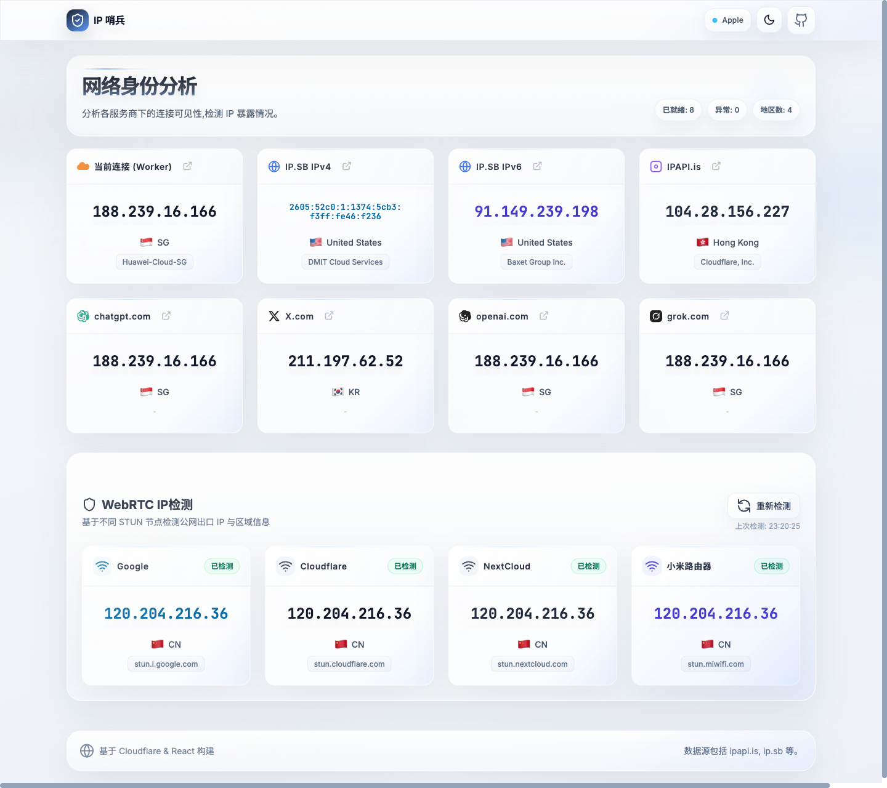
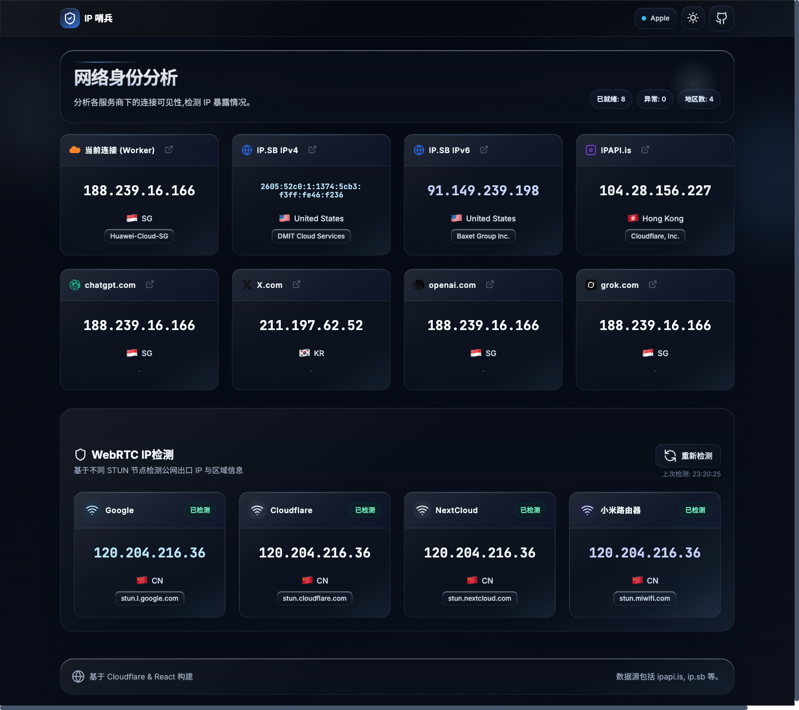

<div align="center">

#  IP 哨兵

**多源 IP 情报分析工具 · 网络身份可见性检测**

[](https://workers.cloudflare.com/)
[](https://react.dev/)
[](LICENSE)

分析各服务商下的连接可见性，检测 IP 暴露情况，通过实时风控评分检查代理/VPN 泄漏。

[**🚀 快速开始部署 →**](#-快速开始)

</div>

---

## 📸 界面预览

#### ☀️ 日间模式



#### 🌙 夜间模式



## ✨ 功能特性

### 🌐 多源 IP 检测
同时从 **8 个不同的数据源** 获取你的出口 IP，直观对比各平台看到的真实连接信息：

| 数据源 | 描述 |
|--------|------|
| **Cloudflare Worker** | 当前连接的 Inbound IP（服务端直出，最准确） |
| **IP.SB IPv4** | 纯 IPv4 出口地址 |
| **IP.SB IPv6** | 纯 IPv6 出口地址 |
| **IPAPI.is** | 综合 IP 情报平台 |
| **ChatGPT** | 通过 `chatgpt.com` 的 CDN Trace 检测 |
| **X.com** | 通过 `help.x.com` 的 CDN Trace 检测 |
| **OpenAI** | 通过 `openai.com` 的 CDN Trace 检测 |
| **Grok** | 通过 `grok.com` 的 CDN Trace 检测 |
| **WebRTC 探测** | 通过 RTCPeerConnection ICE candidates 检测 IP 泄漏 |
| **DNS 探测** | 通过 DoH 查询检测 DNS 解析器和出口 IP |

### 🔍 IP 深度分析
点击任意 IP 地址，查看来自 [ipapi.is](https://ipapi.is) 的详细情报：

- **基本信息** — IP 地址、RIR、运营商/ASN 类型（住宅/机房/商用）
- **综合滥用评分** — 基于运营商分 + ASN 分 + 风险加成的智能评分算法
- **安全检测** — 代理、VPN、Tor、爬虫、滥用 IP、数据中心等 9 项检测
- **位置信息** — 国家、省份、城市、坐标、时区
- **运营商 & ASN 信息** — 组织名称、路由、滥用评分
- **滥用举报联系方式** — 提供相关投诉渠道

### 🎯 VPN / 代理泄漏检测
通过对比多个数据源返回的 IP 和地理位置，快速判断是否存在：
- 代理/VPN 泄漏（不同平台看到不同 IP）
- **DNS 泄漏** — 通过 Cloudflare DoH 和 Google DNS 检测实际使用的 DNS 解析器
- **WebRTC 泄漏** — 通过 RTCPeerConnection ICE candidates 检测本地/公网 IP 暴露

## 🛠️ 技术架构

```
┌──────────────────────────────────────────────┐
│              浏览器 (React 18)                │
│  ┌─────────┐ ┌──────────┐ ┌───────────────┐  │
│  │ 状态卡片 │ │ 详情弹窗 │ │ 风险评分引擎   │  │
│  └────┬────┘ └────┬─────┘ └───────────────┘  │
│       │           │                           │
│  直接请求外部 API    通过 Worker 中转           │
└───────┼───────────┼──────────────────────────┘
        │           │
        ▼           ▼
┌──────────────┐  ┌─────────────────────┐
│ 外部 CDN Trace│  │ Cloudflare Worker    │
│ ip.sb / etc. │  │ (API 中转 + SSR 注入) │
│              │  │  → ipapi.is API      │
└──────────────┘  └─────────────────────┘
```

- **前端**：React 18 + Tailwind CSS（通过 CDN 引入，单文件 SPA）
- **后端**：Cloudflare Workers（零服务器，边缘计算）
- **API 中转**：Worker 代理 ipapi.is 请求，规避 CORS 限制
- **SSR 注入**：服务端直接注入 Cloudflare 识别的访客 IP 和地理信息

## 🔒 安全特性

- **SSRF 防护** — 严格校验 IP/域名输入格式
- **XSS 防护** — JSON 数据安全转义后注入 HTML
- **安全响应头** — `X-Content-Type-Options`、`X-Frame-Options`、`Referrer-Policy`
- **CORS 控制** — 配置跨域资源共享策略

## 🚀 快速开始

### ⚡ 一键部署

点击下方按钮，即可自动跳转到 Cloudflare 部署页面，自动克隆仓库并完成部署：

[](https://deploy.workers.cloudflare.com/?url=https://github.com/jy02739244/ip-query-worker)

### 🔗 Fork 部署（推荐）

Fork 部署可以保持与上游仓库的关联，方便后续同步更新：

**第一步**：Fork 本仓库到你的 GitHub 账号

[](https://github.com/jy02739244/ip-query-worker/fork)

**第二步**：点击下方按钮，选择 **Continue with GitHub**，然后选择你 Fork 的仓库进行部署

[](https://dash.cloudflare.com/?to=/:account/workers-and-pages/create)

> [!TIP]
> 当上游仓库更新后，你可以在 GitHub 中点击 **Sync fork** 同步最新代码，Cloudflare 会自动重新构建部署。

### 手动部署（无需本地环境）

如果不想配置本地开发环境，可以直接通过 Cloudflare Dashboard 手动部署：

1. 登录 [Cloudflare Dashboard](https://dash.cloudflare.com/)
2. 进入 **Workers & Pages** → 点击 **创建** → 选择 **创建 Worker**
3. 为 Worker 命名并点击 **部署**（先部署默认的 Hello World 代码）
4. 部署成功后，点击 **编辑代码**
5. 将本项目 `src/_worker.js` 文件的 **全部内容** 复制并粘贴到编辑器中，替换原有代码
6. 点击右上角 **部署** 按钮保存并发布

> [!TIP]
> 后续更新时，只需重复步骤 4-6，将最新的 `src/_worker.js` 内容粘贴并重新部署即可。

### 前置条件

- [Node.js](https://nodejs.org/) >= 18
- [Wrangler CLI](https://developers.cloudflare.com/workers/wrangler/) (Cloudflare Workers CLI)

### 本地开发

```bash
# 克隆仓库
git clone https://github.com/jy02739244/ip-query-worker.git
cd ip-query-worker

# 安装依赖
npm install

# 启动本地开发服务器
npm run dev
```

访问 `http://localhost:8787` 即可预览。

### 部署到 Cloudflare

```bash
# 登录 Cloudflare
npx wrangler login

# 部署
npm run deploy
```


### 运行测试

```bash
npm test
```

## 📁 项目结构

```
ip-query-worker/
├── src/
│   └── _worker.js       # 核心代码（Worker + React SPA 单文件）
├── docs/
│   ├── screenshot.png    # 界面截图（日间模式）
│   └── screenshot-dark.png # 界面截图（夜间模式）
├── package.json          # 项目配置 & 依赖
├── wrangler.toml         # Cloudflare Workers 配置
├── vitest.config.js      # 测试配置
└── README.md             # 项目说明
```

## 📊 数据源说明

| 数据源 | 用途 | 请求方式 |
|--------|------|----------|
| `Cloudflare cf` 对象 | 当前连接 IP（服务端） | Worker SSR 注入 |
| `api-ipv4.ip.sb` | IPv4 地址 + 地理信息 | 浏览器直连 |
| `api-ipv6.ip.sb` | IPv6 地址 + 地理信息 | 浏览器直连 |
| `api.ipapi.is` | 综合 IP 情报（含风控） | Worker 中转 |
| `*/cdn-cgi/trace` | CDN 出口 IP | 浏览器直连 |
| `RTCPeerConnection` | WebRTC 泄漏检测（本地/公网 IP） | 浏览器 API |
| `cloudflare-dns.com` | DNS 解析器检测（DoH） | 浏览器直连 |
| `dns.google` | DNS 解析器检测（备用 DoH） | 浏览器直连 |
| `1.1.1.1/cdn-cgi/trace` | DNS 出口 IP 和位置 | 浏览器直连 |

## 📝 许可证

本项目基于 [MIT](LICENSE) 许可证开源。

## 🙏 致谢

- [Cloudflare Workers](https://workers.cloudflare.com/) — 边缘计算平台
- [ipapi.is](https://ipapi.is/) — IP 情报 API
- [ip.sb](https://ip.sb/) — IP 查询服务
- [React](https://react.dev/) — 前端框架
- [Tailwind CSS](https://tailwindcss.com/) — CSS 框架
- [Cmliu Github](https://github.com/cmliu) — CM
